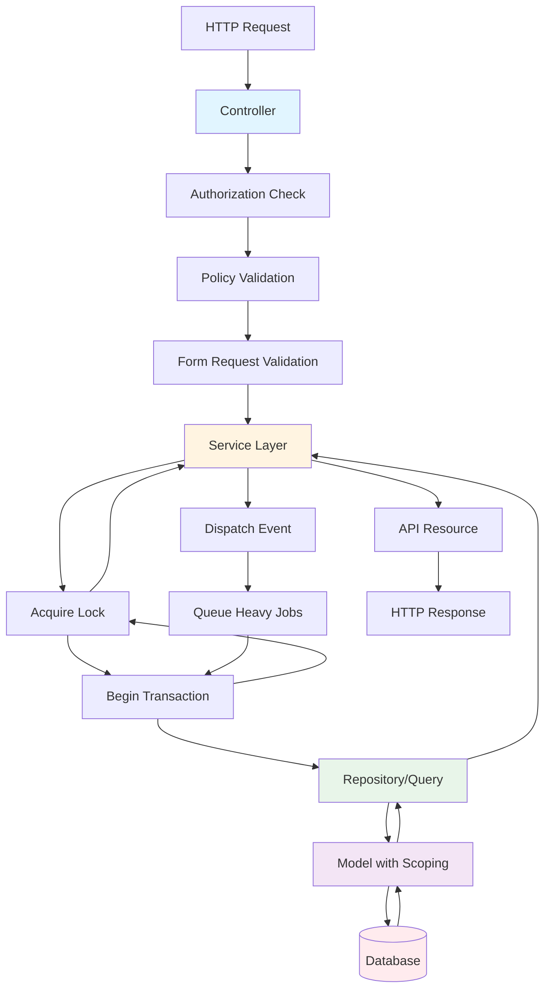

# Architectural Specification - Laravel 12 High-Scale Booking System

## Purpose

This document defines the architectural laws for a high-volume booking system where security and performance are foundational constraints. This is a Modular Monolith architecture - we do NOT use microservices or overcomplicate with CQRS/Event Sourcing initially.

## Core Architectural Philosophy

**Security + Performance > Convenience**

The goal is controlled architecture, not fast scaffolding. All patterns and constraints defined here are mandatory, not optional.

---

## 1. Mandatory Design Patterns

### 1.1 Thin Controllers Rule

**Location:** [app/Http/Controllers/BaseController.php](app/Http/Controllers/BaseController.php)

Controllers MUST:
- Accept request
- Authorize (via policies)
- Validate (via Form Requests)
- Call Service
- Return Resource

Controllers MUST NEVER:
- Contain business logic
- Write queries directly
- Contain transactions
- Handle booking consistency logic

**Enforcement:** All controllers must extend `BaseController`.

**Example:**
```php
class BookingController extends BaseController
{
    public function store(StoreBookingRequest $request, CreateBookingService $service)
    {
        $booking = $service->execute($request->validated());
        return new BookingResource($booking);
    }
}
```

### 1.2 Service Layer (Required)

**Status:** Not yet implemented - MUST be created

Every business use case MUST live in a dedicated Service class.

**Required Services:**
- `App\Services\CreateBookingService`
- `App\Services\CancelBookingService`
- `App\Services\CheckAvailabilityService`
- `App\Services\UpdateBookingService`

**Service Responsibilities:**
- Contain business rules
- Contain DB transactions (use `TransactionalOperations` trait)
- Handle concurrency protection (use `LockManager`)
- Coordinate repositories
- Dispatch events

**Rule:** No booking logic outside Services.

**Base Service Pattern:**
```php
namespace App\Services;

use App\Database\Concerns\TransactionalOperations;
use App\Database\LockManager;

abstract class BaseService
{
    use TransactionalOperations;
    
    protected LockManager $lockManager;
    
    public function __construct(LockManager $lockManager)
    {
        $this->lockManager = $lockManager;
    }
    
    // All services inherit transaction handling
    // All services have access to locking mechanisms
}
```

**Service Example:**
```php
class CreateBookingService extends BaseService
{
    public function execute(array $data)
    {
        return $this->executeInTransaction(function () use ($data) {
            // Business logic here
            // Concurrency protection
            // Event dispatching
        });
    }
}
```

### 1.3 Mandatory Data Scoping Pattern

**Location:** [app/Models/Concerns/UserScoped.php](app/Models/Concerns/UserScoped.php)

Every query returning business data MUST be scoped to the authenticated user.

**Implementation:**
- All models extend `BaseModel` which uses `UserScoped` trait
- Global scope automatically applies `WHERE user_id = {current_user_id}`
- Queries without user context are logged as warnings

**Enforcement:** It must be architecturally difficult to forget scoping. Data leakage across actors is unacceptable.

**Example:**
```php
class Booking extends BaseModel
{
    // Automatically scoped to authenticated user
    // All queries: WHERE user_id = {current_user_id}
}
```

### 1.4 Policy-Based Authorization

**Location:** [app/Policies/BasePolicy.php](app/Policies/BasePolicy.php), [app/Http/Middleware/EnforceAuthorization.php](app/Http/Middleware/EnforceAuthorization.php)

All access control MUST be enforced through Laravel Policies.

**Rules:**
- All policies extend `BasePolicy`
- All CRUD operations must pass policy checks
- UI-based hiding is NOT security
- Middleware `EnforceAuthorization` validates all requests

**Example:**
```php
class BookingPolicy extends BasePolicy
{
    // Inherits view, create, update, delete methods
    // Automatically validates user ownership
}
```

### 1.5 Repository / Query Layer (Controlled Queries)

**Status:** Not yet implemented - MUST be created

Repositories or Query Objects MUST:
- Encapsulate complex filtering
- Handle high-frequency indexed queries
- Avoid N+1 issues
- Provide optimized query paths

**Rule:** No heavy query logic in controllers.

**Base Repository Pattern:**
```php
namespace App\Repositories;

use App\Models\BaseModel;
use Illuminate\Database\Eloquent\Builder;

abstract class BaseRepository
{
    protected BaseModel $model;
    
    public function __construct(BaseModel $model)
    {
        $this->model = $model;
    }
    
    protected function query(): Builder
    {
        // Returns scoped query builder
        // Automatically applies user scoping
        return $this->model->newQuery();
    }
    
    // All repositories handle scoped queries
    // All repositories enforce eager loading
    // All repositories validate indexes
}
```

**Repository Example:**
```php
class BookingRepository extends BaseRepository
{
    public function findAvailableSlots(Carbon $date): Collection
    {
        return $this->query()
            ->where('date', $date)
            ->where('status', 'available')
            ->with(['service', 'location']) // Eager load to avoid N+1
            ->get();
    }
}
```

### 1.6 Transaction + Concurrency Rule (Critical)

**Location:** [app/Database/Concerns/TransactionalOperations.php](app/Database/Concerns/TransactionalOperations.php), [app/Database/LockManager.php](app/Database/LockManager.php)

Booking creation and cancellation MUST:
- Run inside DB transaction
- Use row-level locking OR unique constraints
- Guarantee no double booking

**Implementation:**
- Services use `TransactionalOperations` trait for automatic deadlock retry
- Use `LockManager` for pessimistic/optimistic locking
- Consistency is more important than speed

**Example:**
```php
class CreateBookingService extends BaseService
{
    public function execute(array $data)
    {
        return $this->lockManager->withLock(
            "booking:{$data['slot_id']}",
            10,
            function () use ($data) {
                return $this->executeInTransaction(function () use ($data) {
                    // Check availability with lock
                    // Create booking
                    // Prevent double booking
                });
            }
        );
    }
}
```

### 1.7 Event + Queue Architecture

**Location:** [app/Jobs/BaseJob.php](app/Jobs/BaseJob.php)

After successful booking operations:
- Fire domain event
- Heavy operations MUST be queued

**Examples of queued operations:**
- Notifications
- Reporting updates
- Webhooks
- Sync operations

**Rule:** User-facing operations must stay fast. All jobs extend `BaseJob` for automatic transaction wrapping.

**Example:**
```php
class CreateBookingService extends BaseService
{
    public function execute(array $data)
    {
        $booking = $this->executeInTransaction(function () use ($data) {
            // Create booking
            return Booking::create($data);
        });
        
        // Dispatch event
        event(new BookingCreated($booking));
        
        // Queue heavy operations
        SendBookingConfirmation::dispatch($booking);
        UpdateAvailabilityCache::dispatch($booking);
        
        return $booking;
    }
}
```

---

## 2. Performance Constraints

### 2.1 Database Design Principles

**Location:** [app/Database/Migrations/Concerns/RequiresIndexes.php](app/Database/Migrations/Concerns/RequiresIndexes.php), [app/Database/IndexValidator.php](app/Database/IndexValidator.php)

**Rules:**
- Keep booking table lean
- Split details/payments/history into separate tables
- All frequent filters MUST have proper composite indexes
- Avoid SELECT * in high-load endpoints
- Pagination is mandatory

**Enforcement:** Migrations use `RequiresIndexes` trait. Missing indexes cause migration failures.

**Example:**
```php
Schema::create('bookings', function (Blueprint $table) {
    $table->id();
    $table->foreignId('user_id')->constrained()->index();
    $table->foreignId('service_id')->constrained()->index();
    $table->dateTime('start_time');
    $table->string('status');
    $table->timestamps();
    
    // Composite index for frequent queries
    $table->index(['service_id', 'start_time', 'status']);
    $table->index(['user_id', 'start_time']);
});
```

### 2.2 Caching Rules

**Allowed Caching:**
- Static configuration
- Service listings
- Precomputed reports

**Availability Caching:**
- Must be short-lived (max 5 minutes)
- Must be safe (never stale availability)
- Must be invalidated on booking creation/cancellation

**Infrastructure:**
- Redis is required for: cache, locks, queues

**Example:**
```php
// Cache service listings (safe, static data)
$services = Cache::remember('services:list', 3600, function () {
    return Service::all();
});

// Cache availability (short-lived, invalidated on changes)
$availability = Cache::remember(
    "availability:{$serviceId}:{$date}",
    300, // 5 minutes
    function () use ($serviceId, $date) {
        return $this->checkAvailability($serviceId, $date);
    }
);
```

### 2.3 No N+1 Policy

**Location:** [app/Http/Middleware/QueryPerformanceMonitor.php](app/Http/Middleware/QueryPerformanceMonitor.php)

**Rules:**
- All relations MUST be eager-loaded intentionally
- Query count MUST be controlled in high-load endpoints
- Maximum 50 queries per request
- Maximum 1.0s total query time per request

**Enforcement:** `QueryPerformanceMonitor` middleware logs violations and throws exceptions in debug mode.

**Example:**
```php
// BAD - N+1 problem
$bookings = Booking::all();
foreach ($bookings as $booking) {
    echo $booking->service->name; // N+1 query
}

// GOOD - Eager loading
$bookings = Booking::with('service')->get();
foreach ($bookings as $booking) {
    echo $booking->service->name; // No additional queries
}
```

---

## 3. Security Constraints

### 3.1 Server-Side Enforcement

**Rules:**
- Never trust route parameters
- Never trust request body IDs
- Never trust client filtering

All ownership checks MUST be validated server-side.

**Implementation:**
- Policies validate ownership
- UserScoped trait ensures data isolation
- Controllers never accept IDs from request body for ownership

**Example:**
```php
// BAD - Trusting request body
public function update(Request $request)
{
    $booking = Booking::find($request->input('booking_id'));
    // No ownership check!
}

// GOOD - Server-side validation
public function update(UpdateBookingRequest $request, Booking $booking)
{
    // Policy automatically checks ownership
    // Route model binding ensures booking exists and is scoped
    $service->execute($booking, $request->validated());
}
```

### 3.2 Rate Limiting

**Status:** Must be implemented

Rate limiting MUST be applied to:
- Login endpoints
- Password reset endpoints
- Booking creation endpoints
- Availability check endpoints

**Implementation Pattern:**
```php
// In routes file
Route::post('/bookings', [BookingController::class, 'store'])
    ->middleware(['auth', 'throttle:bookings']);

// In RouteServiceProvider or bootstrap/app.php
RateLimiter::for('bookings', function (Request $request) {
    return Limit::perMinute(10)->by($request->user()?->id ?: $request->ip());
});
```

**Rate Limits:**
- Login: 5 attempts per minute
- Password reset: 3 attempts per hour
- Booking creation: 10 per minute per user
- Availability checks: 60 per minute per user

### 3.3 Sensitive Data Handling

**Rules:**
- Never log secrets
- Encrypt sensitive tokens
- Use HTTPS only
- Secure cookies
- Use strong hashing

**Implementation:**
- Use Laravel's encryption for sensitive data
- Never log passwords, tokens, or API keys
- Use `bcrypt` or `argon2` for password hashing
- Set secure cookie flags in production

---

## 4. Engineering Discipline

### 4.1 Required Layers

Every feature MUST include:
- Form Request validation (extends `BaseRequest`)
- Policy enforcement (extends `BasePolicy`)
- Service usage (business logic)
- Repository usage (if query-heavy)
- Proper indexing consideration

**Feature Checklist:**
- [ ] Form Request created
- [ ] Policy created
- [ ] Service created (if business logic)
- [ ] Repository created (if complex queries)
- [ ] Indexes added to migration
- [ ] Eager loading considered
- [ ] Events dispatched (if needed)
- [ ] Jobs queued (if heavy operations)

### 4.2 Definition of Done

A feature is NOT complete unless:

- Authorization enforced
- Scoping applied
- No N+1 queries
- Indexed queries considered
- Transactions used where needed
- Heavy tasks queued
- Security validated

---

## 5. Growth Strategy

**Current Architecture:**
- Single database
- Strong indexing
- Redis (cache, locks, queues)
- Queue system

**Future Scaling (when proven necessary):**
- Read replicas
- Archiving
- Performance tuning

**Rule:** Microservices are NOT allowed unless proven necessary by measurable bottlenecks.

---

## 6. Architectural Flow

The following diagram illustrates the mandatory flow for all booking operations:



**Flow Rules:**
1. Request enters Controller
2. Controller validates authorization via Policy
3. Controller validates input via Form Request
4. Controller calls Service (no business logic in controller)
5. Service acquires lock for concurrency protection
6. Service begins transaction
7. Service calls Repository for data access
8. Repository uses Model with automatic scoping
9. Model queries Database with proper indexes
10. Service dispatches events
11. Service queues heavy operations
12. Service commits transaction and releases lock
13. Controller returns Resource
14. Response sent to client

---

## 7. Existing Foundation

The codebase already implements:

- **Data Scoping:** `UserScoped` trait, `BaseModel` - [app/Models/Concerns/UserScoped.php](app/Models/Concerns/UserScoped.php)
- **Authorization:** `BasePolicy`, `EnforceAuthorization` middleware - [app/Policies/BasePolicy.php](app/Policies/BasePolicy.php)
- **Transactions:** `TransactionalOperations` trait - [app/Database/Concerns/TransactionalOperations.php](app/Database/Concerns/TransactionalOperations.php)
- **Concurrency:** `LockManager` class - [app/Database/LockManager.php](app/Database/LockManager.php)
- **Performance:** `QueryPerformanceMonitor` middleware - [app/Http/Middleware/QueryPerformanceMonitor.php](app/Http/Middleware/QueryPerformanceMonitor.php)
- **Jobs:** `BaseJob` with transaction wrapping - [app/Jobs/BaseJob.php](app/Jobs/BaseJob.php)
- **Indexing:** `RequiresIndexes` trait, `IndexValidator` - [app/Database/Migrations/Concerns/RequiresIndexes.php](app/Database/Migrations/Concerns/RequiresIndexes.php)

**Missing Components (Must Be Created):**
- Service layer (`App\Services\*`)
- Repository layer (`App\Repositories\*`)
- Rate limiting implementation
- Event dispatching patterns

---

## 8. Enforcement

Violations of these architectural laws result in:
- Authorization failures (403)
- Performance violations (logged, exceptions in debug)
- Migration failures (missing indexes)
- Code review rejection

**Final Rule:** Security and performance are architectural laws. If a future feature violates proper scoping, concurrency safety, transaction safety, indexing strategy, or policy enforcement, the design MUST be rejected.
